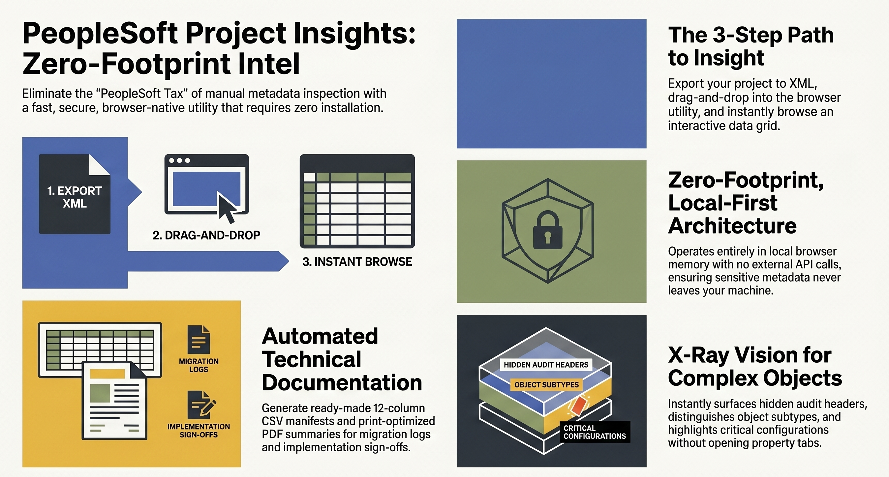

# PeopleSoft Project Insights 🚀
A zero-footprint, browser-native utility designed to modernize how developers and architects inspect, review, and document PeopleSoft projects. 

## 🛑 Bypassing the "PeopleSoft Tax"
The traditional method for reviewing project metadata is broken. Application Designer XML exports are black boxes of base64-encoded tags. Checking a single audit stamp or line of PeopleCode requires high-latency VPNs, active database connections, and a tedious "12-menu click-loop."

**PeopleSoft Project Insights** eliminates this friction. It replaces blind trust with instant transparency, allowing you to assess impact and audit changes in seconds without ever logging into a target environment.

## ✨ Key Features
* **100% Local & Secure:** Operates entirely in your local browser memory. No external API calls, no database connections, and no server dependencies. Your sensitive enterprise metadata never leaves your machine.
* **On-The-Fly Code Decoding:** Automatically converts unreadable Base64-encoded PeopleCode and fragmented HTML/SQL into readable, syntax-highlighted blocks for immediate review.
* **Streamlined Peer Reviews:** Built-in filters allow you to instantly isolate objects marked as `Changed`, `Absent`, or `Custom Changed`, transforming an hours-long hunt into a minutes-long inspection.
* **Automated Documentation:** Generate ready-made migration logs with a single click. Export a highly structured 12-column CSV manifest or a print-optimized PDF summary for change tickets and sign-offs.
* **Deep X-Ray Auditing:** Instantly surfaces critical project-level audit headers (e.g., *Last Updated By*, *Source Operator*) and explicitly maps out complex object deployment flags.

## 🛠️ How to Use (The 3-Step Flow)
1. **Export:** In Application Designer, navigate to `Tools -> Copy Project -> To File` to generate your project XML.
2. **Drag & Drop:** Open the downloaded `PSoft_Project_Insights.html` file in Chrome, Edge, or Firefox. Drag and drop your XML file into the secure drop zone.
3. **Inspect:** Instantly browse the interactive grid, filter by status, and click any row to view decoded source code and metadata.

## 📥 Installation
No installation required. Simply download the latest `.html` release from this repository and open it in your favorite modern web browser.

## Demo XML for Testing
Use the following demo PeopleSoft Project XML file to test **PSoft_Project_Insights.html**:
👉 [Download Demo PeopleSoft Project XML](https://raw.githubusercontent.com/<user>/<repo>/<branch>/MC_ENTERPRISE_DEMO.xml?download=1)

This file contains a large synthetic set of PeopleSoft objects for parser validation.

## 🤝 Contributing
Contributions, issues, and feature requests are welcome! Feel free to check the [issues page](../../issues)

## 📄 License
This project is open-source and available under the MIT License.
